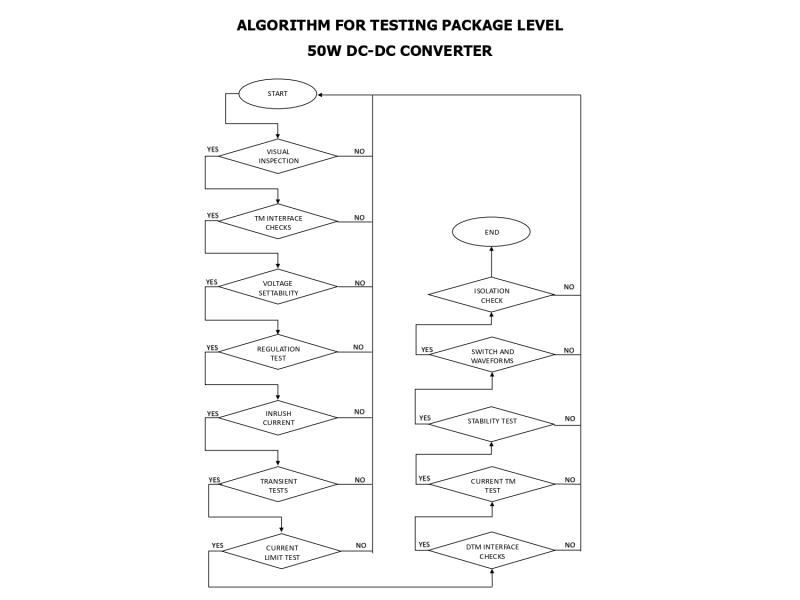

# 50V-DC-DC-Converter-DUT-BMC-For-Testing-and-Validation-Of-Radar-System-Components.
<!DOCTYPE html>
<html lang="en">
<head>
    <meta charset="UTF-8">
    <meta name="viewport" content="width=device-width, initial-scale=1.0">
     NISAR DC-DC Converter Test Framework
</head>
<body>
    <h1>NISAR DC-DC Converter Test Framework</h1>
    
This project implements an advanced and modular test framework for validating package-level DC-DC converters used in ISRO's NISAR satellite project, specifically the SD50F401 (Power Card) and SD50F302 (Control Card).

    <h2> Features</h2>
    <ul>
        <li>Visual inspection simulation</li>
        <li>TM/TC interface validation</li>
        <li>Voltage setability and regulation tests</li>
        <li>Inrush current and transient response analysis</li>
        <li>Output current limit verification</li>
        <li>Stability, waveform, and isolation checks</li>
        <li>Modular design for extensibility and lab integration</li>
    </ul>
    ## System Diagram

*Figure 1: Block diagram of the NISAR DC-DC converter test setup.*
    <h2> Getting Started</h2>
    <h3>Clone Repository</h3>
    <pre><code>git clone https://github.com/&lt;your-username&gt;/nisar-dcdc-test.git
cd nisar-dcdc-test</code></pre>
    <h3>Install Dependencies</h3>
    <pre><code>pip install -r requirements.txt</code></pre>
    <h3>Run Demo</h3>
    <pre><code>python examples/run_demo.py</code></pre>
    <h2> Project Structure</h2>
    <pre><code>nisar-dcdc-test/
├── src/
│   ├── config.py            # Converter specifications
│   ├── logger.py            # Logging utility
│   └── dcdc_tester.py       # Main test class
├── tests/
│   └── test_main.py         # Unit tests
├── examples/
│   └── run_demo.py          # Demo script
├── README.md
├── Image
├── requirements.txt
└── LICENSE</code></pre>
    <h2> License</h2>
    
This project is licensed under the MIT License.

</body>
</html>
